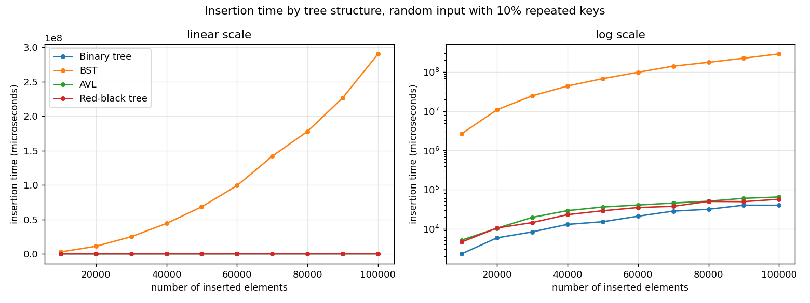
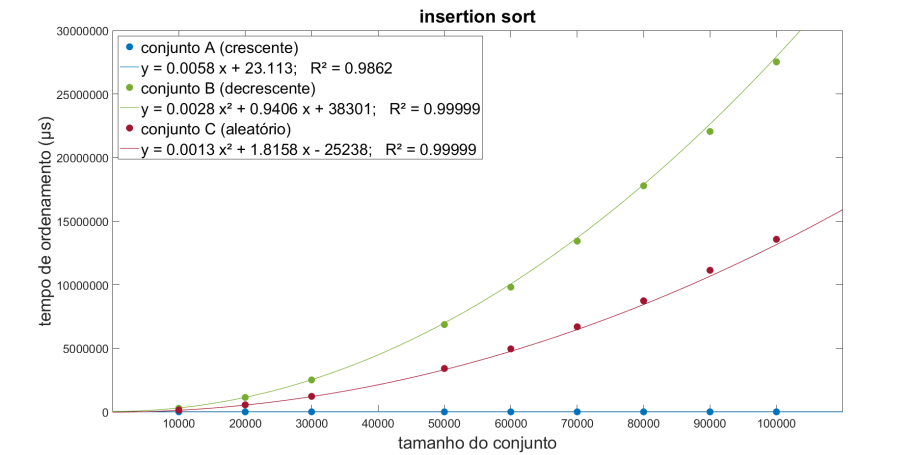
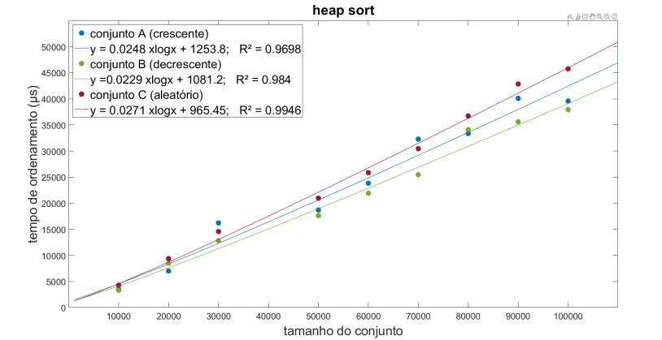
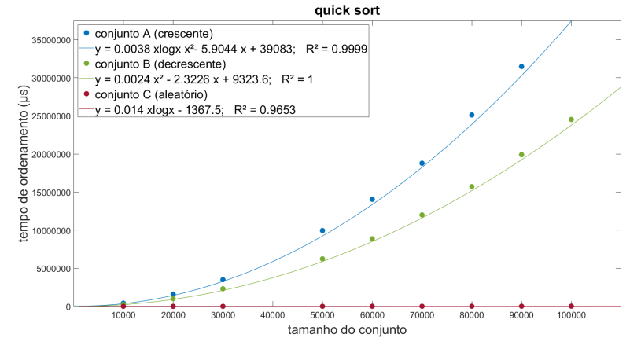
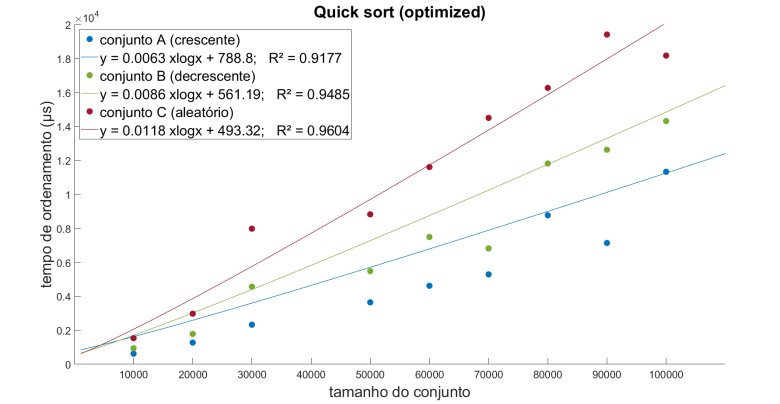
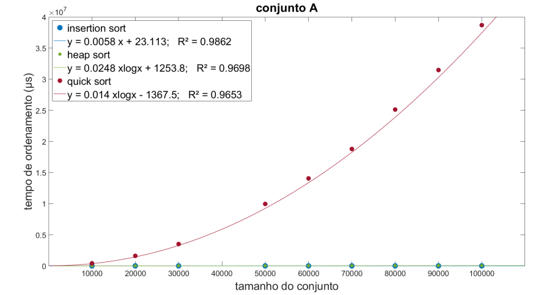
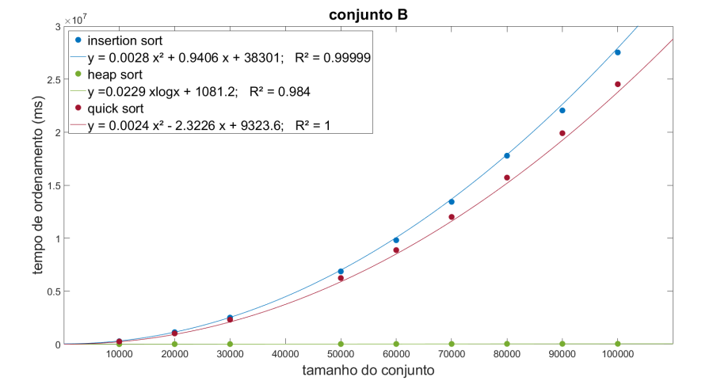
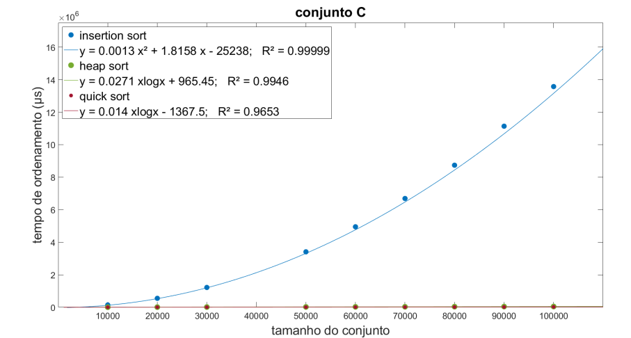

# Data Structures and Algorithms

A collection of C++ projects built for the Algorithms and Data Structures (AED)
course. Each project pairs a working implementation with a written report that
analyses the algorithms and benchmarks their performance under different inputs.

## Repository layout

```
.
├── 01-two-sum/              Two-sum problem (report only, code listed in the report)
│   └── report.pdf
├── 02-tree-performance/     Binary, BST, AVL and Red-Black tree comparison
│   ├── report.pdf
│   └── src/
├── 03-sorting-algorithms/   Sorting algorithm comparison
│   ├── report.pdf
│   └── src/
└── docs/images/             Benchmark figures used in this README
```

Each numbered folder is a self-contained project. Source code lives in `src/`
and the accompanying analysis is in `report.pdf` (written in Portuguese).

## Projects

### 01 - Two Sum

Given an array and a target value, find two numbers that add up to that target.
This project is documented in the report only; the source code is included at
the end of the report.

### 02 - Tree Performance

Implementations of four tree structures and a benchmark comparing how they
behave as the number of inserted nodes grows.

- `binary_tree.cpp` - plain binary tree
- `bst_tree.cpp` - binary search tree
- `avl_tree.cpp` - self-balancing AVL tree
- `rbt_tree.cpp` - red-black tree
- `node.cpp` - shared node definition
- `printer.cpp` - tree printing helper
- `main.cpp` - driver that inserts nodes in ordered, reverse-ordered and random
  order, then times each structure



Insertion times measured in the report, on random input with 10% repeated keys.
The BST is three to four orders of magnitude slower than everything else and grows
quadratically, so on a linear axis (left) it flattens the other three curves
entirely; the log axis (right) shows that the plain binary tree, the AVL tree and
the red-black tree all sit within a small constant factor of each other. Full
tables for the increasing, decreasing and 90%-repeated cases are in
[`02-tree-performance/report.pdf`](02-tree-performance/report.pdf).

### 03 - Sorting Algorithms

Implementations of several sorting algorithms and a benchmark measuring their
running time on increasing, decreasing and random inputs.

- `insertionSort.cpp` - insertion sort
- `heapSort.cpp` - heap sort
- `quickSort.cpp` - quicksort
- `quickSortOptimized.cpp` - quicksort with optimisations
- `testCases.cpp` - input generators (increasing, decreasing, random)
- `main.cpp` - driver that runs and times each algorithm

Measured running times with fitted curves, per algorithm. Set A is increasing
input, set B decreasing, set C random.

| Insertion sort | Heap sort |
| -------------- | --------- |
|  |  |

| Quicksort | Quicksort, optimised |
| --------- | -------------------- |
|  |  |

Insertion sort is the clearest illustration of input sensitivity: linear on
already-sorted input (set A, flat on the axis) and quadratic on the other two.
Plain quicksort has the opposite problem, because it always picks the last element
as its pivot, so sorted and reverse-sorted input is its worst case; the optimised
version fixes that with median-of-three pivoting and an insertion-sort cutoff for
small partitions, which pulls all three sets back to n log n.

The same data grouped by input set instead, so the algorithms can be compared
directly:

| Set A, increasing | Set B, decreasing | Set C, random |
| ----------------- | ----------------- | ------------- |
|  |  |  |

## Building and running

Each project is compiled by pointing the compiler at its `main.cpp`. The other
`.cpp` files are pulled in through `#include` directives, so only `main.cpp`
needs to be passed to the compiler.

Tree performance project:

```
cd 02-tree-performance/src
g++ -std=c++17 -O2 main.cpp -o trees
./trees
```

Sorting algorithms project:

```
cd 03-sorting-algorithms/src
g++ -std=c++17 -O2 main.cpp -o sorting
./sorting
```

A modern C++ compiler (g++ or clang++) with C++17 support is all that is
required.

## Reports

Every project folder contains a `report.pdf` with the problem description,
implementation details, complexity analysis and benchmark results.

## Authors

- Miguel Castela
